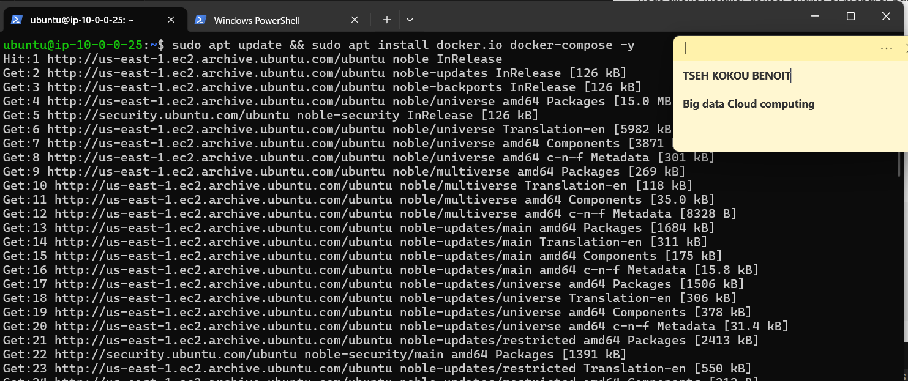
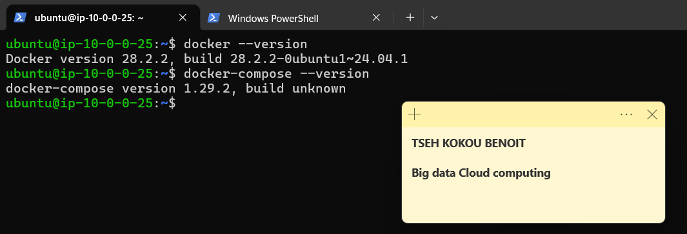
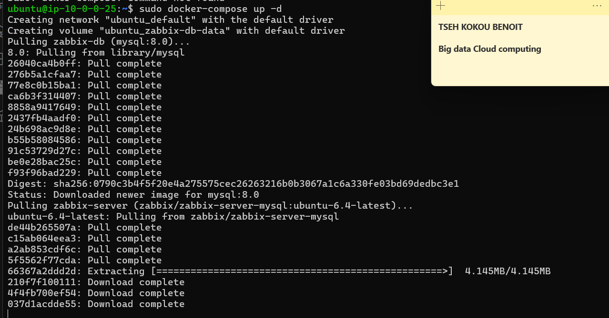
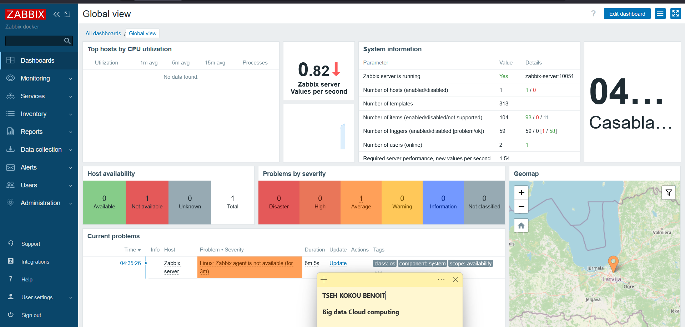
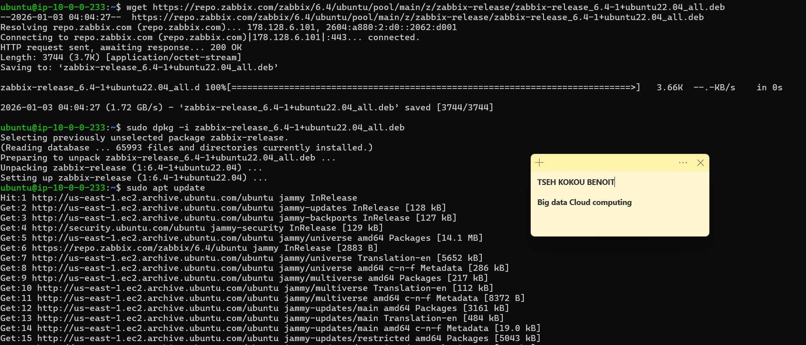
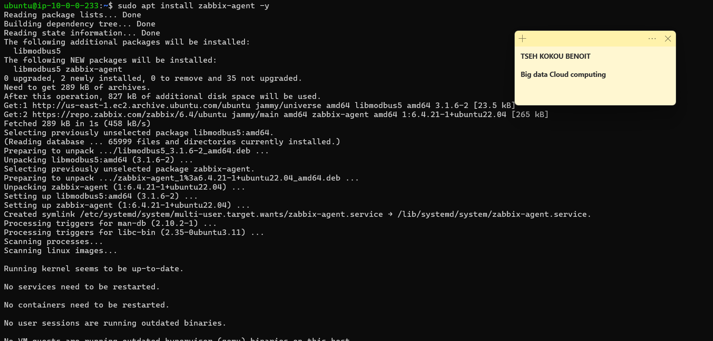
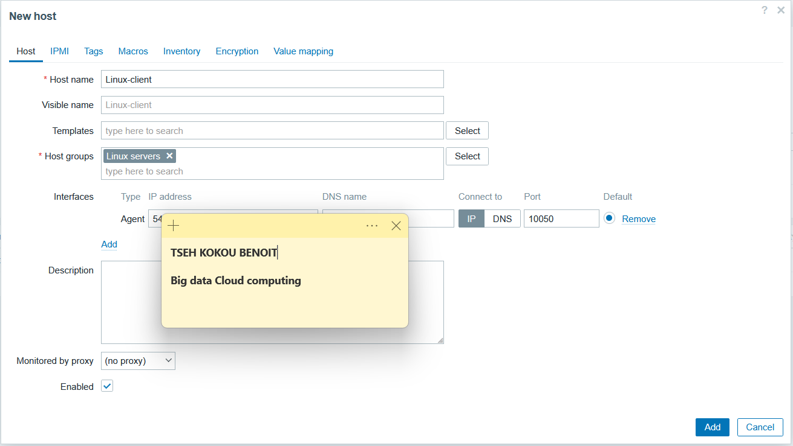

|  | <center width="500">**UNIVERSITÉ HASSAN II DE CASABLANCA**<br> <br> ENSET MOHAMMEDIA<br> <br> *DEPARTEMENT DE MATHEMATIQUES INFORMATIQUE*</center> |  |
| :--- | :---: | ---: |
</center>


<center>

# 📊 Mise en œuvre d'une infrastructure cloud de supervision centralisée sous AWS
## Déploiement de Zabbix conteneurisé pour le monitoring d'un parc hybride (Linux & Windows)

</center>

<center>     </center>

## 🎓 Informations Générales :
* **Filière :** Ingénierie Informatique Big Data Cloud Computing (IIBDCC)
* **Module :** Sécurité des SI & Cyber Sécurité
* **Réalisé par :** TSEH Kokou Benoît
* **Encadré par :** Prof. Azeddine KHIAT
* **Année Universitaire :** 2025-2026

---

## 📝 1. Introduction
Dans le cadre de la gestion moderne des infrastructures informatiques, la surveillance (monitoring) est devenue un pilier essentiel pour garantir la haute disponibilité et la performance des services. Ce projet consiste en la **mise en œuvre d'une infrastructure de supervision centralisée** hébergée sur le cloud **Amazon Web Services (AWS)**.

L'objectif principal est de déployer une solution conteneurisée à l'aide de **Docker** pour assurer le monitoring en temps réel d'un parc informatique hybride, composé d'instances **Linux** et **Windows**. Le choix d'une architecture conteneurisée permet une plus grande flexibilité de déploiement et une gestion simplifiée des dépendances du serveur Zabbix.

Le projet s'articule autour de trois axes majeurs :


- **Configuration de l'infrastructure Cloud :** Mise en place d'un VPC, de sous-réseaux et de groupes de sécurité adaptés pour autoriser les flux de monitoring (ports 10050/10051) et l'accès web (ports 80/443).

- **Déploiement du serveur Zabbix :** Installation via Docker-Compose sur une instance Ubuntu (t3.large).
- **Supervision du parc :** Installation et configuration des agents Zabbix sur des clients Ubuntu et Windows Server pour la remontée de métriques CPU, RAM et réseau.
    

**Axes majeurs :**
* Déploiement sur AWS (EC2 & VPC).
* Orchestration des services via Docker-Compose.
* Supervision d'instances Linux (Ubuntu) et Windows Server.

---
## 🌐 Architecture globale du projet 


## ☁️ 2. Architecture Réseau
L'infrastructure réseau est isolée au sein d'un VPC   spécifique (Région : `us-east-1`) avec une configuration stricte des flux de sécurité via les **Security Groups**.

- Pour  Ce faire , nous nous connectons au console de **AWS** dans la regions de  `us-east-1` où nous créons les  un **VPC**  avec le **CDIR Bloc: 10.0.0.0/16** que nous allons  nommer : **VPC_Projet_Zabbix**  


- Nous créons dans Ce réseau virtuel, un  sous-réseau **Subnet_VPC_Projet_Zabbix** avec le **CDIR Bloc: 10.0.0.0/24**


- Ensuite nous créons deux Sécurité  groupe pour   pour filter l'accès aux instances: 
   - **Le premier est : Zabbix-Server-SG** :

     il a les règle suivante : 
        
        - **Port 22** : pour le protocole **SSH** permet de se connecter à l'instance  sur laquelle tourne Zabbix à distance .
        - **Ports 80 et 443** : pour le protocole **HTTP/HTTPS**, utilié  ppour l'affichage de l'interface web de **Zabbix**.
        - **Port 10051** : **Protocle TCP** , ce port est utilisé par Zabbix pour recevoir un les informations des agents.

       
         
 

   - **Le deuxième est : Agents-SG** 

     - **Le port 10050**: TCP	Écoute de l'agent (Passive Mode)
     - **Le port 3389** :	RDP	Accès distant Windows
     - **le port 22** :  	SSH	Administration Linux à distance


     


- Nous allons créer une Passerelle poour permmetre au ressouce de pourvoir accéder à l'internet. Pour cela nous créeons Internet gateway:
 
 
 -  On ajoute une route :

   
     

    
    

</img>
</img>

*(Figure 1 : Schéma de l'infrastructure Cloud AWS et des Security Groups)*


---

## 🖥️ 3. Architecture des Instances EC2
| Rôle | Type d'instance | OS | Usage |
| :--- | :--- | :--- | :--- |
| **Serveur Zabbix** | t3.large | Ubuntu 22.04 LTS | Serveur Docker & Dashboard |
| **Client Linux** | t3.medium | Ubuntu 22.04 LTS | Monitoring Agent Linux |
| **Client Windows** | t3.large | Windows Server 2022 | Monitoring Agent Windows |


*(Figure 2 : Capture d'écran des instances EC2 en état 'Running' dans la console AWS)*

---

## 🚀 4. Déploiement du Serveur Zabbix (Docker)
Nous Connectons à l'instance **Zabbix-server**  afin de deployer Le serveur zabbix. Comme nous volous faire un deploiement via  conteneur docker, nous allons installer dokcer engine  et préparer par après un fichier *docker-compose.yml* :
- Nous installons  **docker engine** via le commande( nous installons aussi docker-compose pour faciliter  le deploiement):

```bash
sudo apt update && sudo apt install docker.io docker-compose -y
```




On a notre fichier [docker-compose.yml](./docker-compose.yml) avec les service  de **zabbix serveur** , **zabbix web**  avec une base de données MySQL persistante. Pour les questios de sécurité nous avons crée un  fichier `.env` pour les varible sensiblie: 

**`docker-compose.yaml`**
```yaml
services:
  zabbix-db:
    image: mysql:8.0
    container_name: zabbix-db
    restart: always
    command: --character-set-server=utf8 --collation-server=utf8_bin --default-authentication-plugin=mysql_native_password
    --log_bin_trust_function_creators=1
    environment:
      - MYSQL_USER=${MYSQL_USER}
      - MYSQL_PASSWORD=${MYSQL_PASSWORD}
      - MYSQL_ROOT_PASSWORD=${MYSQL_ROOT_PASSWORD}
      - MYSQL_DATABASE=${MYSQL_DATABASE}
    volumes:
      - ./zabbix-db-data:/var/lib/mysql

  zabbix-server:
    image: zabbix/zabbix-server-mysql:ubuntu-6.4-latest
    container_name: zabbix-server
    restart: always
    ports:
      - "10051:10051"
    environment:
      - DB_SERVER_HOST=zabbix-db
      - MYSQL_USER=${MYSQL_USER}
      - MYSQL_PASSWORD=${MYSQL_PASSWORD}
      - MYSQL_DATABASE=${MYSQL_DATABASE}
    depends_on:
      - zabbix-db

  zabbix-web:
    image: zabbix/zabbix-web-nginx-mysql:ubuntu-6.4-latest
    container_name: zabbix-web
    restart: always
    ports:
      - "80:8080"
    environment:
      - ZBX_SERVER_HOST=zabbix-server
      - DB_SERVER_HOST=zabbix-db
      - MYSQL_USER=${MYSQL_USER}
      - MYSQL_PASSWORD=${MYSQL_PASSWORD}
      - MYSQL_DATABASE=${MYSQL_DATABASE}
      - PHP_TZ=${ZBX_PHP_TZ}
    depends_on:
      - zabbix-db
      - zabbix-server

volumes:
  zabbix-db-data:
```

**.env :**

```.conf

# Base de données
MYSQL_ROOT_PASSWORD=
MYSQL_USER=
MYSQL_PASSWORD=
MYSQL_DATABASE=

# Configuration Zabbix
ZBX_PHP_TZ=

```

Avec la commande `docker-compose up -d` on  on deploie le server zabbix:



On peut voir l'interface de  comme suit :



---
## 5. Configuration des agents :

### - Configuration de l'agent  Linxu-client :

 Pour configurer cet agent , on va executer  onon télécharge et on installe Linux agent sur l'instance **Linux-client-zabbix**  on executer les commandes suivantes :
 
 ```bash
 # Téléchargement des paquet
wget https://repo.zabbix.com/zabbix/6.4/ubuntu/pool/main/z/zabbix-release/zabbix-release_6.4-1+ubuntu22.04_all.deb

# Installation du  dépôt
sudo dpkg -i zabbix-release_6.4-1+ubuntu22.04_all.deb

# Mise à jour la liste des paquets
sudo apt update
 ```




**Installation**
```bash

sudo apt install zabbix-agent -y
```



Après  on fait la     change le fichier de configuration : 

```bash

sudo nano /etc/zabbix/zabbix_agentd.conf
```

on modifie les variable suivante :

```bash
Server=Ip du serveur

ServerActive=ip du serveur

Hostname=Nom_De_Cette_Instance
```


Et oon redemarre le service :

```bash
sudo systemctl restart zabbix-agent
sudo systemctl enable zabbix-agent
```


On se connecter a l'interface de  Zabbix pour faire   complèter la configuration :



Étape 1 : Préparation de l'Infrastructure Cloud (AWS)

C'est la fondation de votre projet. Vous devez créer un environnement réseau capable de faire communiquer le serveur et ses agents.

    VPC & Réseau : Utilisez le VPC par défaut ou créez-en un nouveau avec un sous-réseau public dans la région us-east-1.

    Security Groups (Critique) : Créez deux groupes de sécurité :

        SG-Serveur : Autorisez le port 80 (Web), 22 (SSH) et surtout le port 10051 (Trapper) pour recevoir les données des agents.

        SG-Clients : Autorisez le port 22 (SSH), 3389 (RDP pour Windows) et le port 10050 pour que le serveur puisse interroger les agents.

    Lancement des Instances :

        Zabbix Server : Instance t3.large sous Ubuntu 22.04.

        Agent Linux : Instance t3.medium sous Ubuntu.

        Agent Windows : Instance t3.large sous Windows Server (pour garantir la fluidité avec 8Go de RAM).

Étape 2 : Déploiement du Serveur Zabbix avec Docker

Sur votre instance Zabbix Server, exécutez les commandes suivantes :

    Installer Docker :
    Bash

sudo apt update && sudo apt install docker.io docker-compose -y

Déployer via Docker-Compose : Créez un fichier docker-compose.yml incluant les images zabbix-server-mysql, zabbix-web-nginx-mysql et mysql:8.0.

Lancement :
Bash

    sudo docker-compose up -d

    Vérification : Accédez à l'interface via http://<IP_PUBLIQUE_SERVEUR>. Les identifiants par défaut sont Admin / zabbix.

Étape 3 : Configuration des Agents (Clients)

Vous devez maintenant dire aux clients d'envoyer leurs données au serveur.

    Sur Linux :

        Installez l'agent : sudo apt install zabbix-agent.

        Modifiez /etc/zabbix/zabbix_agentd.conf :

            Server=<IP_PUBLIQUE_SERVEUR_ZABBIX>

            Hostname=Client-Linux

        Redémarrez : sudo systemctl restart zabbix-agent.

    Sur Windows :

        Téléchargez l'installeur MSI Zabbix Agent sur le site officiel.

        Pendant l'installation, renseignez l'IP du serveur Zabbix dans le champ "Zabbix Server IP".

Étape 4 : Monitoring et Validation

    Ajout des Hôtes : Dans l'interface Zabbix, allez dans Configuration > Hosts > Create Host.

    Templates : Utilisez les templates standards (Linux by Zabbix agent et Windows by Zabbix agent).

    Vérification du statut : Attendez que l'icône ZBX devienne verte.

Étape 5 : Préparation des Livrables (Conseils)

    Captures d'écran : Prenez des captures nettes. Utilisez l'outil "Capture" de Windows. Annotez vos images (entourez l'IP ou le statut vert).

    Vidéo (5-10 min) : 1. Montrez les instances sur AWS. 2. Montrez l'interface Zabbix avec les deux hôtes connectés. 3. Montrez un graphique de CPU en temps réel.

    GitHub : Votre dépôt doit contenir votre docker-compose.yml, vos scripts de configuration et un beau README.md (celui que nous avons préparé ensemble).

Rappel crucial : Dans le Learner Lab, les instances s'arrêtent automatiquement. Si vous reprenez votre travail après une pause, n'oubliez pas de relancer vos conteneurs avec docker-compose up -d sur le serveur.