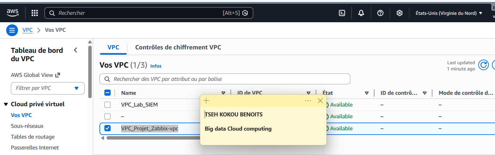
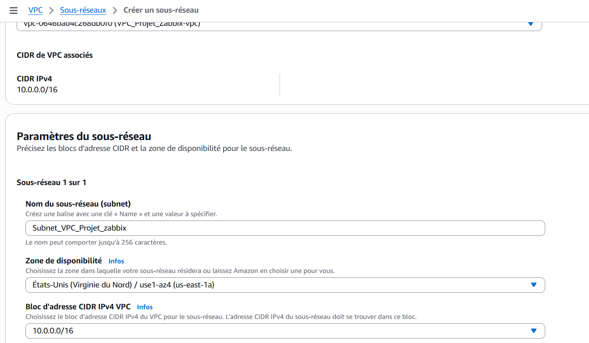
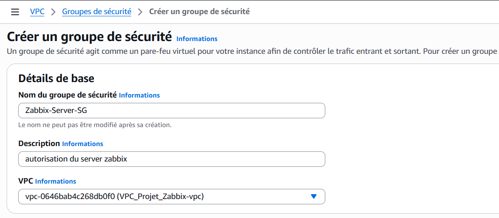
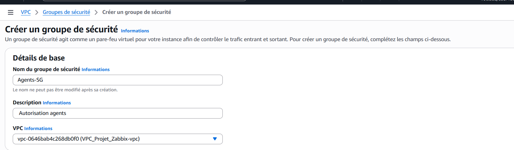
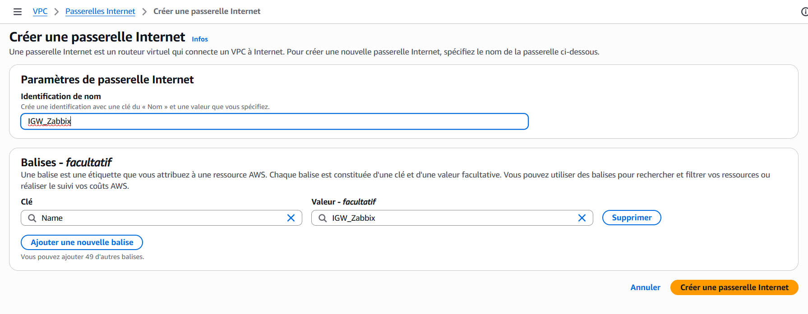
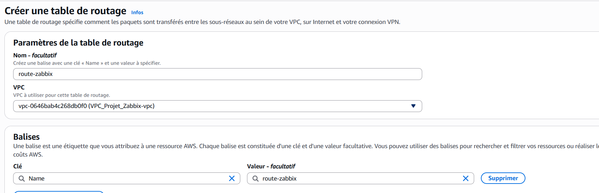
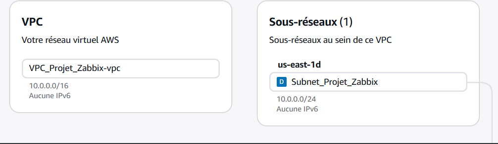
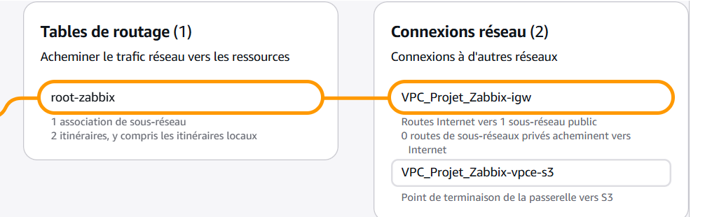
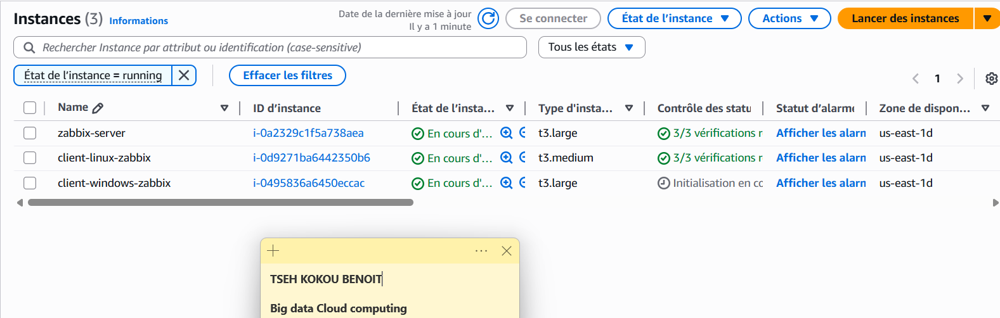

|  | <center width="500">**UNIVERSITÉ HASSAN II DE CASABLANCA**<br> <br> ENSET MOHAMMEDIA<br> <br> *DEPARTEMENT DE MATHEMATIQUES INFROMATIQUE*</center> |  |
| :--- | :---: | ---: |
</center>


<center>

# 📊 Mise en œuvre d'une infrastructure cloud de supervision centralisée sous AWS
## Déploiement de Zabbix conteneurisé pour le monitoring d'un parc hybride (Linux & Windows)

</center>

<center>     </center>

## 🎓 Informations Générales :
* **Filière :** Ingénierie Informatique Big Data Cloud Computing (IIBDCC)
* **Module :** Sécurité des SI & Cyber Sécurité
* **Réalisé par :** TSEH Kokou Benoît
* **Encadré par :** Prof. Azeddine KHIAT
* **Année Universitaire :** 2025-2026

---

## 📝 1. Introduction
Dans le cadre de la gestion moderne des infrastructures informatiques, la surveillance (monitoring) est devenue un pilier essentiel pour garantir la haute disponibilité et la performance des services. Ce projet consiste en la **mise en œuvre d'une infrastructure de supervision centralisée** hébergée sur le cloud **Amazon Web Services (AWS)**.

L'objectif principal est de déployer une solution conteneurisée à l'aide de **Docker** pour assurer le monitoring en temps réel d'un parc informatique hybride, composé d'instances **Linux** et **Windows**. Le choix d'une architecture conteneurisée permet une plus grande flexibilité de déploiement et une gestion simplifiée des dépendances du serveur Zabbix.

Le projet s'articule autour de trois axes majeurs :


- **Configuration de l'infrastructure Cloud :** Mise en place d'un VPC, de sous-réseaux et de groupes de sécurité adaptés pour autoriser les flux de monitoring (ports 10050/10051) et l'accès web (ports 80/443).

- **Déploiement du serveur Zabbix :** Installation via Docker-Compose sur une instance Ubuntu (t3.large).
- **Supervision du parc :** Installation et configuration des agents Zabbix sur des clients Ubuntu et Windows Server pour la remontée de métriques CPU, RAM et réseau.
    

**Axes majeurs :**
* Déploiement sur AWS (EC2 & VPC).
* Orchestration des services via Docker-Compose.
* Supervision d'instances Linux (Ubuntu) et Windows Server.

---
## 🌐 Architecture globale du projet 


## ☁️ 2. Architecture Réseau
L'infrastructure réseau est isolée au sein d'un VPC   spécifique (Région : `us-east-1`) avec une configuration stricte des flux de sécurité via les **Security Groups**.

- Pour  Ce faire , nous nous connectons au console de **AWS** dans la regions de  `us-east-1` où nous créons les  un **VPC**  avec le **CDIR Bloc: 10.0.0.0/16** que nous allons  nommer : **VPC_Projet_Zabbix**  



- Nous créons dans Ce réseau virtuel, un  sous-réseau **Subnet_VPC_Projet_Zabbix** avec le **CDIR Bloc: 10.0.0.0/24**


- Ensuite nous créons deux Sécurité  groupe pour   pour filter l'accès aux instances: 
   - **Le premier est : Zabbix-Server-SG** :

     il a les règle suivante : 
        
        - **Port 22** : pour le protocole **SSH** permet de se connecter à l'instance  sur laquelle tourne Zabbix à distance .
        - **Ports 80 et 443** : pour le protocole **HTTP/HTTPS**, utilié  ppour l'affichage de l'interface web de **Zabbix**.
        - **Port 10051** : **Protocle TCP** , ce port est utilisé par Zabbix pour recevoir un les informations des agents.

       
         
 

   - **Le deuxième est : Agents-SG** 

     - **Le port 10050**: TCP	Écoute de l'agent (Passive Mode)
     - **Le port 3389** :	RDP	Accès distant Windows
     - **le port 22** :  	SSH	Administration Linux à distance


     


- Nous allons créer une Passerelle poour permmetre au ressouce de pourvoir accéder à l'internet. Pour cela nous créeons Internet gateway:
 
 
 -  On ajoute une route :

   
     

    
    

</img>
</img>

*(Figure 1 : Schéma de l'infrastructure Cloud AWS et des Security Groups)*


---

## 🖥️ 3. Architecture des Instances EC2
| Rôle | Type d'instance | OS | Usage |
| :--- | :--- | :--- | :--- |
| **Serveur Zabbix** | t3.large | Ubuntu 22.04 LTS | Serveur Docker & Dashboard |
| **Client Linux** | t3.medium | Ubuntu 22.04 LTS | Monitoring Agent Linux |
| **Client Windows** | t3.large | Windows Server 2022 | Monitoring Agent Windows |


*(Figure 2 : Capture d'écran des instances EC2 en état 'Running' dans la console AWS)*

---

## 🚀 4. Déploiement du Serveur Zabbix (Docker)
Le serveur est déployé avec une base de données MySQL persistante.

**Fichier `docker-compose.yaml` complet :**
```yaml
version: '3.5'
services:
  zabbix-db:
    image: mysql:8.0
    environment:
      - MYSQL_DATABASE=zabbix
      - MYSQL_USER=zabbix
      - MYSQL_PASSWORD=zabbix_pwd
      - MYSQL_ROOT_PASSWORD=root_pwd

  zabbix-server:
    image: zabbix/zabbix-server-mysql:latest
    ports:
      - "10051:10051"
    environment:
      - DB_SERVER_HOST=zabbix-db
      - MYSQL_USER=zabbix
      - MYSQL_PASSWORD=zabbix_pwd

  zabbix-web:
    image: zabbix/zabbix-web-nginx-mysql:latest
    ports:
      - "80:8080"
    environment:
      - ZBX_SERVER_HOST=zabbix-server
      - DB_SERVER_HOST=zabbix-db
      - MYSQL_USER=zabbix
      - MYSQL_PASSWORD=zabbix_pwd


# 📊 Projet : Supervision Centralisée sous AWS

|  | <center>**UNIVERSITÉ HASSAN II DE CASABLANCA**<br>ENSET MOHAMMEDIA<br>Filière IIBDCC</center> |  |
| :--- | :---: | ---: |

---

## 🛠️ Sujet : Déploiement de Zabbix conteneurisé pour le monitoring d'un parc hybride

<p align="center">
   
  
</p>

**Réalisé par :** TSEH Kokou Benoît  
**Encadré par :** Prof. Azeddine KHIAT  
**Année :** 2025/2026

---

## 📝 1. Introduction
Ce projet met en œuvre une infrastructure de monitoring sur **AWS** utilisant **Zabbix** et **Docker**.

## ☁️ 2. Architecture Réseau
L'infrastructure est isolée dans un VPC sécurisé.


## 🖥️ 3. Instances EC2
- **Serveur :** t3.large (Ubuntu + Docker)
- **Client Linux :** t3.medium
- **Client Windows :** t3.large

## 📈 4. Résultats & Monitoring
Une fois configurés, les agents apparaissent avec le statut **ZBX au vert**.


---
🔗 **Lien du dépôt :** [https://github.com/Believer2001/supervision_centralisee_sous_-AWS](https://github.com/Believer2001/supervision_centralisee_sous_-AWS)